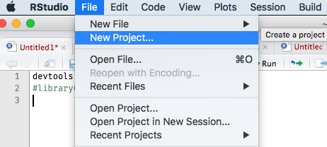
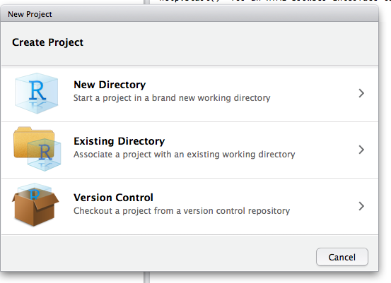
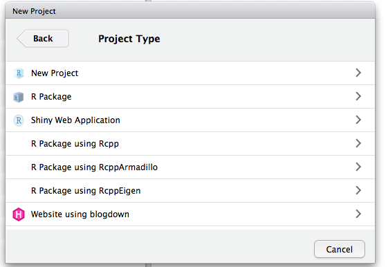
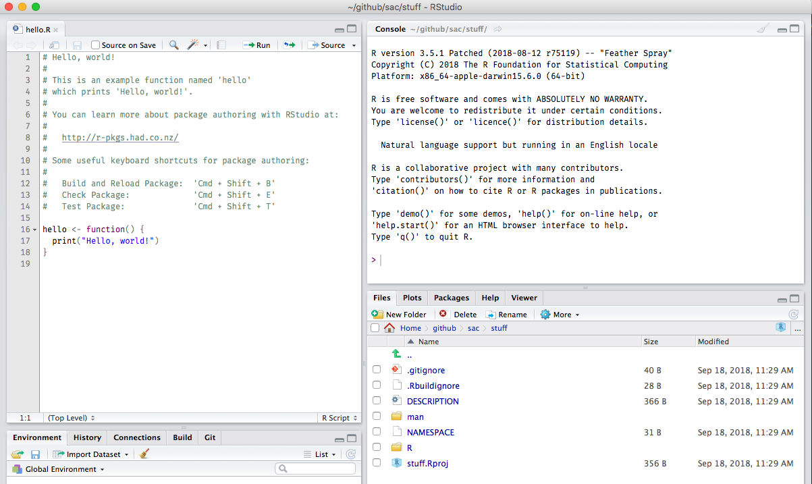

```{r echo = FALSE}
knitr::opts_chunk$set(
  comment = "#>",
  warning = FALSE,
  message = FALSE
)
```


# Make a package {#make-a-package}

Let's make a package!

## in RStudio






## on your command line {#cli}

Using the `devtools` package:

```r
devtools::create("foo")
```

Or, with the `mason` package:

install first:

```r
devtools::install_github("metacran/mason")
devtools::install_github("metacran/mason.rpkg")
devtools::install_github("metacran/mason.github")
```

Create a package

```r
mason::mason('bar')
```

## usethis {#usethis}

Optionally, you can use the `usethis` package <https://github.com/r-lib/usethis> 
to help in step in package create/maintainance.
